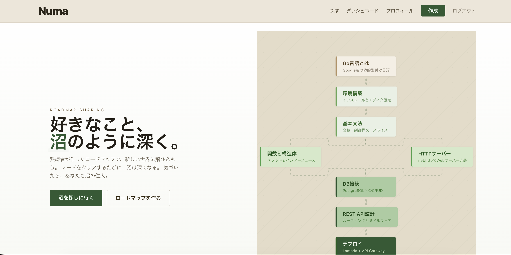
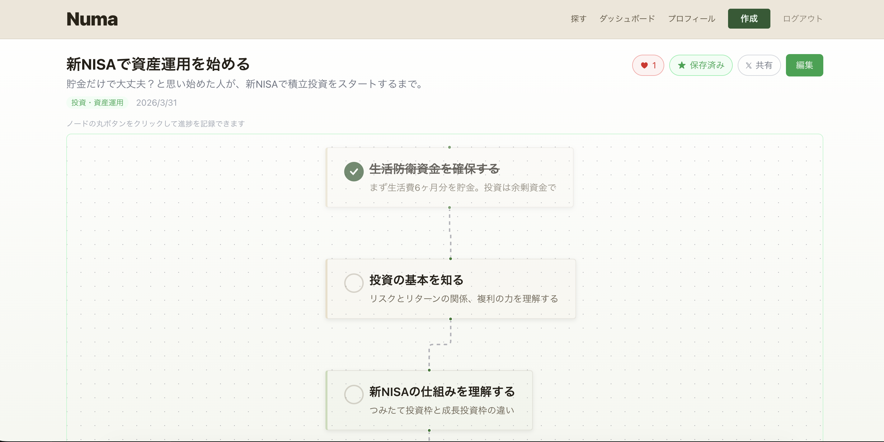
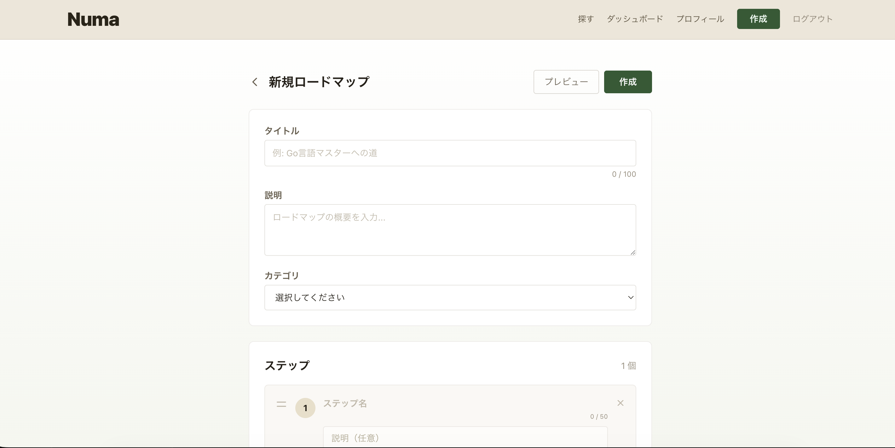
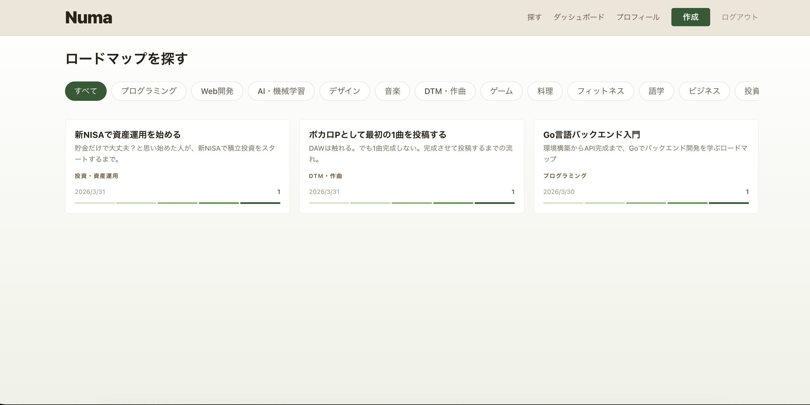

# Numa（沼）— ロードマップ作成＆共有アプリ

熟練者が初心者向けにマインドマップ形式のロードマップを作成・公開・共有するWebアプリケーション。沼の深さ（色の濃さ）で学習の深度を表現する、緑基調の沼テーマデザイン。

## 技術スタック

- **Frontend**: React 18 + TypeScript + Vite 5 + Tailwind CSS 3 + @xyflow/react 12 + Zustand 4 + React Router v6
- **Backend**: Go 1.26 + AWS Lambda (provided.al2023) + aws-sdk-go-v2
- **Database**: DynamoDB (シングルテーブル設計、GSI x3)
- **Auth**: Amazon Cognito (SRP 認証 + JWT)
- **Infra**: Terraform + AWS サーバーレス (CloudFront + S3, API Gateway + WAF, Lambda, DynamoDB, Cognito)
- **CI/CD**: GitHub Actions (ci.yml / deploy.yml / deploy-prod.yml)
- **監視**: CloudWatch アラーム + X-Ray トレーシング + 構造化ログ (slog) + SNS 通知
- **その他**: @dnd-kit (ドラッグ&ドロップ) + dagre (グラフレイアウト) + react-helmet-async (SEO) + react-hot-toast (通知)

## 主な機能

- マインドマップ形式のロードマップ作成・編集（@xyflow/react）
- 自動保存（2秒 debounce）
- ロードマップの公開・非公開設定
- いいね・ブックマーク機能
- 進捗トラッキング（沼レベル 0〜5 で完了率を可視化）
- カテゴリ別探索（16種）・カーソルベースページネーション
- ユーザープロフィール管理
- X (Twitter) 共有
- レスポンシブデザイン・SEO/OGP 対応
- 沼テーマ（深度カラーパレット + 生物シルエット装飾）

## スクリーンショット

### トップページ


### ロードマップ詳細


### ロードマップ作成


### 探索ページ


## セットアップ

### 前提ツール

- Go 1.26+, Node.js 20 LTS, Docker, Terraform 1.5+, AWS CLI v2

### ローカル開発

```bash
git clone <repository-url> && cd numa-project

# DynamoDB Local 起動
docker compose up -d

# テーブル作成（初回のみ）
aws dynamodb create-table \
  --endpoint-url http://localhost:8000 \
  --table-name dev-numa-main \
  --attribute-definitions \
    AttributeName=PK,AttributeType=S \
    AttributeName=SK,AttributeType=S \
    AttributeName=GSI1PK,AttributeType=S \
    AttributeName=GSI1SK,AttributeType=S \
    AttributeName=GSI2PK,AttributeType=S \
    AttributeName=GSI2SK,AttributeType=S \
    AttributeName=GSI3PK,AttributeType=S \
    AttributeName=GSI3SK,AttributeType=S \
  --key-schema AttributeName=PK,KeyType=HASH AttributeName=SK,KeyType=RANGE \
  --global-secondary-indexes \
    '[{"IndexName":"GSI1","KeySchema":[{"AttributeName":"GSI1PK","KeyType":"HASH"},{"AttributeName":"GSI1SK","KeyType":"RANGE"}],"Projection":{"ProjectionType":"ALL"}},{"IndexName":"GSI2","KeySchema":[{"AttributeName":"GSI2PK","KeyType":"HASH"},{"AttributeName":"GSI2SK","KeyType":"RANGE"}],"Projection":{"ProjectionType":"ALL"}},{"IndexName":"GSI3","KeySchema":[{"AttributeName":"GSI3PK","KeyType":"HASH"},{"AttributeName":"GSI3SK","KeyType":"RANGE"}],"Projection":{"ProjectionType":"ALL"}}]' \
  --billing-mode PAY_PER_REQUEST

# フロントエンド
cd frontend && npm install && cp .env.example .env
# .env を編集して API URL と Cognito 設定を入力
npm run dev          # localhost:5173

# バックエンド
cd backend && go mod tidy
make build && make test
```

## 開発コマンド

| コマンド | 説明 |
|---------|------|
| `docker compose up -d` | DynamoDB Local 起動 |
| `cd frontend && npm run dev` | フロントエンド開発サーバー |
| `cd frontend && npm run build` | プロダクションビルド |
| `cd frontend && npm run lint` | ESLint |
| `cd frontend && npm run test` | Vitest テスト |
| `cd backend && make build` | Go ビルド（Lambda 用） |
| `cd backend && make test` | Go テスト |
| `cd backend && make lint` | golangci-lint |

## テスト

```bash
# バックエンド ユニットテスト
cd backend && make test

# バックエンド 統合テスト（DynamoDB Local 必要）
DYNAMODB_ENDPOINT=http://localhost:8000 go test ./internal/repository/ -v -count=1

# フロントエンド
cd frontend && npm run test
```

## API エンドポイント

### 認証不要

| Method | Path | 説明 |
|--------|------|------|
| GET | `/api/health` | ヘルスチェック |
| GET | `/api/users/:id` | ユーザープロフィール |
| GET | `/api/users/:id/roadmaps` | ユーザーの公開ロードマップ |
| GET | `/api/roadmaps/:id` | ロードマップ詳細（公開のみ） |
| GET | `/api/roadmaps/explore` | 公開ロードマップ一覧 |
| GET | `/api/ogp/:id` | OGP メタタグ HTML |

### 認証必要（Cognito JWT）

| Method | Path | 説明 |
|--------|------|------|
| GET/PUT | `/api/users/me` | 自分のプロフィール |
| POST | `/api/roadmaps` | ロードマップ作成 |
| GET | `/api/roadmaps/my` | 自分のロードマップ一覧 |
| PUT/DELETE | `/api/roadmaps/:id` | 更新・削除（所有者のみ） |
| POST/PUT/DELETE | `/api/roadmaps/:id/nodes[/:nodeId]` | ノード CRUD |
| PUT | `/api/roadmaps/:id/nodes/batch` | ノード一括更新（最大100件） |
| POST/DELETE | `/api/roadmaps/:id/edges[/:edgeId]` | エッジ CRUD |
| POST/DELETE | `/api/roadmaps/:id/like` | いいね |
| POST/DELETE | `/api/roadmaps/:id/bookmark` | ブックマーク |
| GET | `/api/bookmarks` | 自分のブックマーク一覧 |
| GET | `/api/roadmaps/:id/progress` | ロードマップの進捗取得 |
| PUT | `/api/roadmaps/:id/progress/nodes/:nodeId` | ノード完了 |
| DELETE | `/api/roadmaps/:id/progress/nodes/:nodeId` | ノード未完了に戻す |
| GET | `/api/progress` | 自分の全進捗一覧 |

## デプロイ

### GitHub Actions 設定

**Secrets**: `AWS_ACCESS_KEY_ID`, `AWS_SECRET_ACCESS_KEY`

> **Note**: 現在は長期 AWS アクセスキーで認証しています。本番運用時は [GitHub Actions OIDC](https://docs.github.com/en/actions/security-for-github-actions/security-hardening-your-deployments/configuring-openid-connect-in-amazon-web-services) による短期トークン認証への移行を推奨します。

**Variables**:

| Variable | 説明 | 例 |
|----------|------|-----|
| `API_LAMBDA_NAME` | API Lambda 関数名 | `dev-numa-api` |
| `POST_CONFIRMATION_LAMBDA_NAME` | Cognito トリガー Lambda | `dev-numa-post-confirmation` |
| `S3_BUCKET_NAME` | フロントエンド S3 バケット | `dev-numa-frontend` |
| `CLOUDFRONT_DISTRIBUTION_ID` | CloudFront ID | `E1234567890ABC` |
| `VITE_API_URL` | API Gateway URL | `https://xxx.execute-api...` |
| `VITE_COGNITO_USER_POOL_ID` | Cognito User Pool ID | `ap-northeast-1_xxx` |
| `VITE_COGNITO_CLIENT_ID` | Cognito App Client ID | `xxx` |
| `VITE_CLOUDFRONT_URL` | CloudFront URL | `https://dxxx.cloudfront.net` |

### CI/CD パイプライン

- **ci.yml（PR 時）**: lint + test + terraform validate + gosec + カバレッジ
- **deploy.yml（main マージ時）**: ビルド → Lambda デプロイ → S3 → CloudFront 無効化
- **deploy-prod.yml（手動）**: 本番デプロイ（手動承認ゲート付き、ロールバック対応）

### Terraform 初回デプロイ

Cognito ↔ Lambda 循環依存のため、初回は2段階:

```bash
cd infra
# 1. cognito の post_confirmation_lambda_arn = "" で apply
# 2. Lambda ARN 生成後、元に戻して再 apply
```

## アーキテクチャ

```
[ブラウザ] → [CloudFront + S3 (SPA)]
                ↓
           [API Gateway + WAF] → Cognito JWT 検証
                ↓
           [Lambda (Go)] → [DynamoDB]

[CloudWatch] → ログ・アラーム・X-Ray
```

### DynamoDB シングルテーブル設計

| エンティティ | PK | SK |
|-------------|-----|-----|
| ユーザー | `USER#<userId>` | `PROFILE` |
| ロードマップ | `ROADMAP#<roadmapId>` | `META` |
| ノード | `ROADMAP#<roadmapId>` | `NODE#<nodeId>` |
| エッジ | `ROADMAP#<roadmapId>` | `EDGE#<edgeId>` |
| いいね | `ROADMAP#<roadmapId>` | `LIKE#<userId>` |
| ブックマーク | `USER#<userId>` | `BOOKMARK#<roadmapId>` |
| 進捗 | `USER#<userId>` | `PROGRESS#<roadmapId>` |

GSI: GSI1（ユーザー別一覧）/ GSI2（公開フィード・カテゴリ別）/ GSI3（ブックマーク逆引き）

## セキュリティ

- API Gateway スロットリング + WAF / CloudFront WAF + セキュリティヘッダ
- Cognito MFA（オプショナル）/ S3 暗号化 + バージョニング / DynamoDB 暗号化
- CORS 本番環境は明示的オリジン指定 / Lambda X-Ray トレーシング

## 制限値

| 項目 | 上限 |
|------|------|
| ノード数/ロードマップ | 100 |
| エッジ数/ロードマップ | 200 |
| タイトル | 100文字 |
| ノードラベル | 50文字 |
| ノード説明 | 500文字 |
| ロードマップ説明 | 1000文字 |
| ロードマップ数/ユーザー | 50 |
| タグ数/ロードマップ | 5 |
| バッチ更新ノード数 | 100 |

## ライセンス

Private
